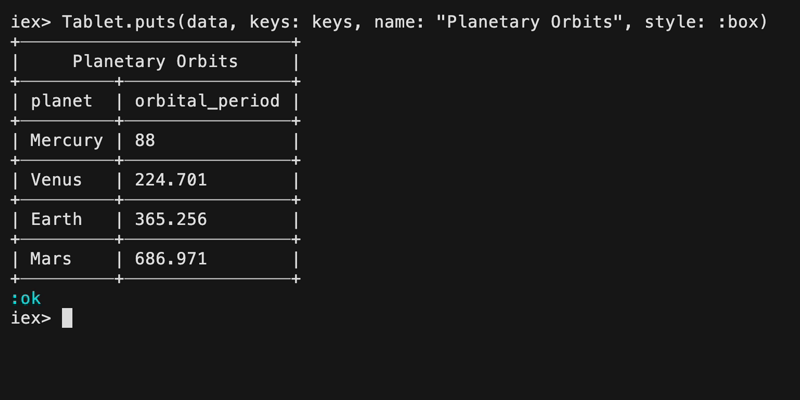
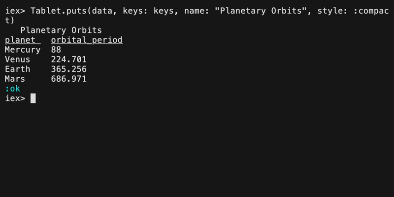
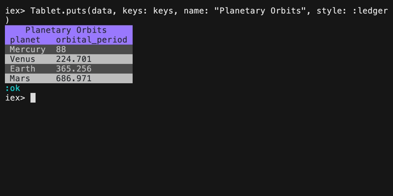
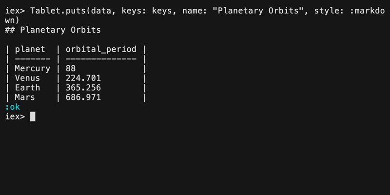
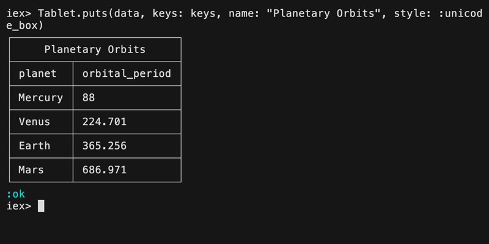

# Style Gallery

1. [Box](#box)
1. [Compact](#compact)
1. [Ledger](#ledger)
1. [Markdown](#markdown)
1. [Unicode Box](#unicode-box)

## Box

Render tabular data with borders drawn from the ASCII character set. This
should render everywhere.

To use, pass `style: :box` to `Tablet.puts/2` or `Tablet.render/2`.

## Compact

This style produces compact output by only underlining the header and adding
whitespace around data. It is the default style.

## Ledger

Render tabular data as rows that alternate colors.

To use, pass `style: :ledger` to `Tablet.puts/2` or `Tablet.render/2`.

## Markdown

Render tabular data as a GitHub-flavored markdown table. Multi-line cells
have their newlines replaced with ` ` tags.

Pass `style: :markdown` to `Tablet.puts/2` or `Tablet.render/2` to use.

## Unicode Box

Render tabular data with borders drawn with Unicode characters. This is a nicer
take on the `:box` style.

To use, pass `style: :unicode_box` to `Tablet.puts/2` or `Tablet.render/2`.

